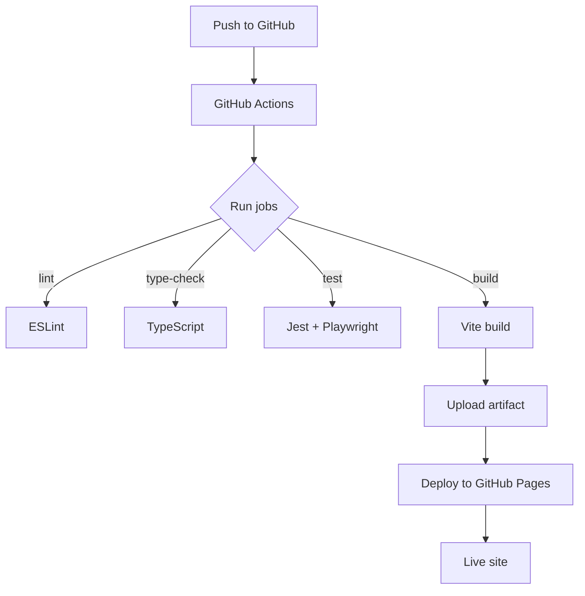

вичи план за посилання# Детализированный план создания проекта **SvitloSk**

## 1. Выбор стека UI и роутинга

| Параметр | Выбор | Обоснование |
|----------|-------|-------------|
| **Библиотека UI** | **React (v18)** + **TypeScript** | Позволяет использовать компонентный подход, упрощает миграцию текущих скриптов в ES‑модули и поддерживает lazy‑loading. React‑экосистема бесплатна и широко поддерживается.
| **Роутер** | **React Router v6** (lightweight) | Предоставляет декларативный роутинг, вложенные маршруты и поддержку `BrowserRouter`/`HashRouter`. Для полностью статического хостинга (GitHub Pages) удобно использовать `HashRouter`, чтобы не требовать серверных rewrite‑правил.
| **Альтернатива** | Vanilla‑SPA‑router (самописный) | Подойдёт, если проект будет без React, но потребует больше кода и тестов. Выбираем React, т.к. уже планируется использовать JSX‑компоненты (`Card.tsx`, `Toast.tsx`).

### Как подключить роутер

```tsx
// src/app/router.tsx
import { HashRouter, Routes, Route } from "react-router-dom";
import Cabinet from "../pages/Cabinet";
import Home from "../pages/Home";
import Tomorrow from "../pages/Tomorrow";

export const AppRouter = () => (
  <HashRouter>
    <Routes>
      <Route path="/" element={<Home />} />
      <Route path="/cabinet" element={<Cabinet />} />
      <Route path="/tomorrow" element={<Tomorrow />} />
    </Routes>
  </HashRouter>
);
```

Инициализация в `src/main.tsx`:

```tsx
import React from "react";
import { createRoot } from "react-dom/client";
import { AppRouter } from "./app/router";
import "./styles/index.css"; // Tailwind + PostCSS

createRoot(document.getElementById("root")!).render(<AppRouter />);
```

## 2. Стек стилей

| Технология | Выбор | Причина |
|------------|-------|--------|
| **PostCSS** | ✅ | Позволяет подключать плагины (autoprefixer, postcss-nesting) и интегрируется в Vite без лишних настроек.
| **Tailwind CSS** | ✅ | Бесплатный набор утилитарных классов, ускоряет прототипирование и уменьшает размер CSS за счёт purge‑режима.
| **SCSS** | ✅ (опционально) | Если нужны более сложные стили, можно писать их в `.scss` и импортировать в `src/styles/*.scss`. SCSS будет компилироваться через PostCSS‑plugin `postcss-scss`.

### Конфигурация Tailwind + PostCSS

**`tailwind.config.cjs`**

```js
/** @type {import('tailwindcss').Config} */
module.exports = {
  content: ["./src/**/*.{tsx,ts,js,jsx}", "./index.html"],
  theme: {
    extend: {},
  },
  plugins: [],
};
```

**`postcss.config.cjs`**

```js
module.exports = {
  plugins: {
    tailwindcss: {},
    autoprefixer: {},
    // optional nesting for SCSS‑like syntax
    "postcss-nesting": {},
  },
};
```

**`src/styles/index.css`** (точка входа стилей)

```css
@tailwind base;
@tailwind components;
@tailwind utilities;

/* Если нужен SCSS‑синтаксис, можно импортировать .scss файлы */
@import "./variables.scss";
```

## 3. Бесплатные сервисы для хостинга и CI/CD

| Сервис | Бесплатный план | Что покрывает |
|--------|----------------|---------------|
| **GitHub Pages** | Неограниченно | Статический хостинг артефактов сборки (`npm run build`).
| **Vercel** | Hobby (бесплатно) | Автоматический деплой из репозитория, поддержка SSR (не нужен). Можно использовать как альтернативу GitHub Pages.
| **Netlify** | Free tier | Статический хостинг + функции `netlify.toml` для redirects.
| **GitHub Actions** | Бесплатно для публичных репозиториев | CI‑pipeline (lint, type‑check, тесты, сборка, деплой).

В план включён деплой на **GitHub Pages** (самый простой и полностью бесплатный). При желании можно переключиться на Vercel/Netlify без изменения кода.

## 4. Обновлённый пошаговый план (TODO‑лист)

> **Важно:** После создания файла план будет автоматически добавлен в `plans/` и вы сможете открыть его в VS Code.

1. **Аудит текущего кода SSSK** – собрать карту модулей, зависимостей и точек входа (`pwa/js/modules/*`, `pwa/js/pages/*`, `pwa/sw.js`).
2. **Сформировать список функций/классов, требующих миграции в TypeScript** (например `UserService`, `DataManager`).
3. **Создать скрипт‑шаблон для конвертации *.js → *.ts** (использовать `jscodeshift`).
4. **Создать папку `SvitloSk`** в `C:/Users/АТом/Desktop/Antigravity/`.
5. **Инициализировать Git‑репозиторий** и добавить удалённый репозиторий на GitHub.
6. **Запустить `npm init vite@latest`** в `SvitloSk` – выбрать `vanilla` + TypeScript, затем установить React‑плагин:
   ```bash
   npm i -D @vitejs/plugin-react
   ```
7. **Установить базовые зависимости**:
   ```bash
   npm i -D typescript vite-plugin-pwa vite-imagetools tailwindcss postcss autoprefixer \
       eslint eslint-config-prettier prettier @typescript-eslint/parser @typescript-eslint/eslint-plugin \
       jest ts-jest @testing-library/react @testing-library/jest-dom playwright \
       idb zod react react-dom react-router-dom
   ```
8. **Скопировать статические файлы** из `SSSK/pwa` в `SvitloSk/public` (манифест, иконки) и в `SvitloSk/src/assets` (доп. изображения).
9. **Настроить `vite.config.ts`** (см. раздел *Конфигурация Vite* ниже).
10. **Создать структуру проекта** (`src/app`, `src/pages`, `src/components`, `src/services`, `src/schemas`, `src/styles`, `src/assets`, `src/admin`).
11. **Перенести `pwa/index.html`** в шаблон Vite (`index.html`) и подключить манифест и стили.
12. **Переписать скрипты из `pwa/js/modules`** в ES‑модули (`.ts`/`.tsx`).
13. **Реализовать лёгкую обёртку IndexedDB** (`src/services/db.ts`).
14. **Создать `src/services/DataManager.ts`** с fallback‑логикой и миграцией схем.
15. **Описать JSON‑схемы** в `src/schemas/` с помощью Zod.
16. **Добавить Service Worker** (`src/sw.ts`) через `vite-plugin-pwa`.
17. **Реализовать UI Notification Service** (`src/services/NotificationService.ts`).
18. **Создать компонент `Card`** (`src/components/Card.tsx`) с lazy‑loading.
19. **Перенести страницы** (`cabinet`, `home`, `tomorrow`) в `src/pages/` и настроить код‑сплиттинг.
20. **Выделить админ‑консоль** в `src/admin/`.
21. **Настроить ESLint + Prettier + TypeScript** (конфиги `.eslintrc.cjs`, `.prettierrc`, `tsconfig.json`).
22. **Добавить тестовый стек** (Jest + Testing Library, Playwright).
23. **Настроить GitHub Actions CI/CD** (`.github/workflows/ci.yml`).
24. **Обновить `README.md`** – включить инструкции, CI‑badge и Mermaid‑диаграмму.
25. **Проверить `public/manifest.json`** и дополнить недостающие поля.
26. **Оптимизировать ассеты** (vite‑imagetools → WebP, хеш‑имена, lazy‑load).
27. **Внедрить PostCSS + autoprefixer** (см. `postcss.config.cjs`).
28. **Добавить Mermaid‑диаграмму** процесса сборки и деплоя в `README.md`.
29. **Финальная проверка** – `npm run dev`, `npm test`, `npm run build`.

## 5. Конфигурация Vite (ключевые фрагменты)

```ts
import { defineConfig } from "vite";
import react from "@vitejs/plugin-react";
import { VitePWA } from "vite-plugin-pwa";
import { imagetools } from "vite-imagetools";
import path from "path";

export default defineConfig({
  plugins: [react(), imagetools(),
    VitePWA({
      manifest: {
        name: "SvitloSk",
        short_name: "Svitlo",
        start_url: "/",
        display: "standalone",
        background_color: "#ffffff",
        theme_color: "#1976d2",
        icons: [
          { src: "/assets/icon-192.png", sizes: "192x192", type: "image/png" },
          { src: "/assets/icon-512.png", sizes: "512x512", type: "image/png" },
        ],
      },
      workbox: {
        runtimeCaching: [
          {
            urlPattern: ({ request }) => request.destination === "script" || request.destination === "style",
            handler: "StaleWhileRevalidate",
            options: { cacheName: "static-resources" },
          },
          {
            urlPattern: ({ url }) => url.pathname.startsWith("/data/"),
            handler: "CacheFirst",
            options: { cacheName: "api-data", expiration: { maxEntries: 50, maxAgeSeconds: 86400 } },
          },
        ],
        navigateFallback: "/offline.html",
      },
    }),
  ],
  resolve: {
    alias: {
      "@/src": path.resolve(__dirname, "src"),
      "@/assets": path.resolve(__dirname, "src/assets"),
    },
  },
  server: { open: true },
  build: { sourcemap: true },
});
```

## 6. Пример `package.json`‑скриптов (полный набор)

```json
{
  "scripts": {
    "dev": "vite",
    "build": "vite build",
    "preview": "vite preview",
    "lint": "eslint src --ext .ts,.tsx",
    "format": "prettier --write \"src/**/*.{ts,tsx,js,jsx,css,scss}\"",
    "type-check": "tsc --noEmit",
    "test": "jest",
    "test:e2e": "playwright test",
    "manifest:check": "manifest-validator public/manifest.json"
  },
  "engines": { "node": ">=20", "npm": ">=9" }
}
```

## 7. Mermaid‑диаграмма CI/CD pipeline (вставить в `README.md`)



---

**Следующий шаг** – перейти в режим **code** и начать реализацию первого блока (создание папки, инициализация репозитория, запуск Vite). Если требуется изменить что‑либо в этом документе, дайте знать.

